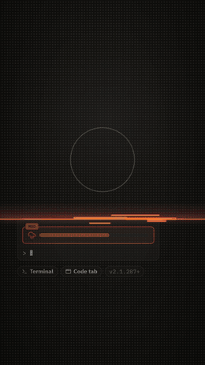
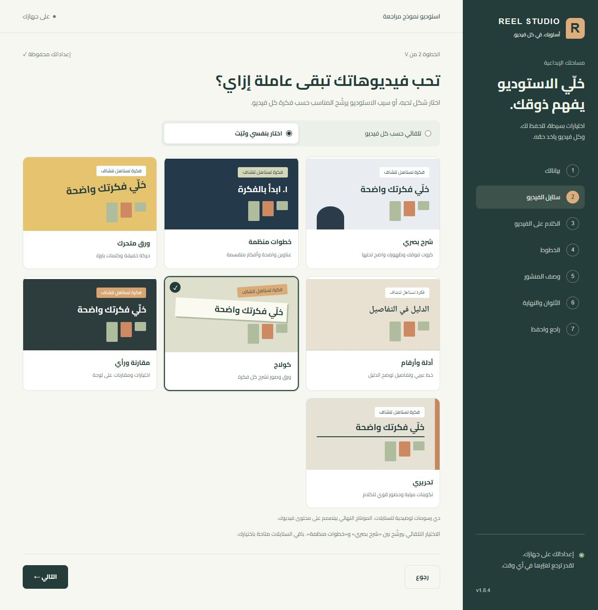

<div dir="rtl">

<p align="center">
  
</p>

<h1 align="center">سجّل فكرتك. أو حوّل حلقتك لريلز. 🎬</h1>

<p align="center">
  <b>شرح قدام الكاميرا، تسجيل شاشة، أو كليبنج من بودكاست طويل: مقاطع 9:16 بموشن جرافيك وكابشن عربي، وعلى ذوقك.</b><br>
  مجاني ومفتوح المصدر · Windows 64-bit<br>
  مع Claude Code أو Codex
</p>

<p align="center">
  <a href="#start"></a>
</p>

<p align="center">
  <a href="#camera-explainers">شرح قدام الكاميرا</a> ·
  <a href="#motion-explainers">شرح بالموشن</a> ·
  <a href="#podcast-clipping">كليبنج وبودكاست</a> ·
  <a href="#showcase">شوف أعمالنا</a> ·
  <a href="#use-cases">استخدمه في إيه؟</a> ·
  <a href="#delivery-quality">جودة التسليم</a> ·
  <a href="#preferences">ظبّط ذوقك</a> ·
  <a href="#styles">الـ٧ ستايلات</a> ·
  <a href="https://github.com/mohamedabdou-ai/reel-studio/releases/latest">آخر إصدار</a>
</p>

**استوديو مونتاج محلي، ومعاه Skill بتوجّه مساعدك خطوة بخطوة.** تحط الفيديو وتقول عايز إيه بالكلام العادي؛ المساعد يراجع معاك الكلام والقص، يبني المشاهد، ويجهّز التسليم. تقدر تراجع وتعدّل قبل التصدير.

> **شوف المونتاج بيتغيّر قدامك في v1.8.5** 🆕 المحرر يفتح من أول معاينة جاهزة، وتتابع القص والكابشن والمشاهد أثناء شغل المساعد. تقدر توقف المتابعة وتعدّل بإيدك؛ اختيارات الستايل والخط وباقي إعداداتك محفوظة.

**الفكرة تتشاف، والمونتاج يفضل بإيدك:** المساعد يقترح وينفّذ، وأنت تراجع الكلام والقص والشكل وتعدّل من المحرر. اختار الستايل والخط والألوان ونهاية الفيديو مرة، وغيّرهم لفيديو واحد وقت ما تحتاج.

**موشن يشرح فكرتك، وفحوصات تحمي تسليمك:** [مناطق آمنة، حماية الوش، وصوت وتصدير متظبطين](#delivery-quality).

<a id="podcast-clipping"></a>

## حلقة واحدة… محتوى لأكتر من فكرة 🎙️✂️

عندك بودكاست، حوار، أو فيديو شرح طويل؟ خلي المساعد يساعدك تطلع منه مقاطع قصيرة؛ كل مقطع له فكرة واضحة وبداية ونهاية مفهومتين.

- **اختيار المقاطع:** يرشّح الأجزاء اللي فيها إجابة أو موقف أو فكرة تستحق ريل، وأنت تراجع اختياره.
- **قص له معنى:** يقترح حذف السكتات والإعادات، مع الحفاظ على سياق الكلام وترتيب الجمل اللي هتفضل.
- **كل مقطع له مونتاجه:** كابشن عربي، إعادة تأطير لرأسي، وكروت ورسوم تشرح الجملة لما تخدمها.
- **دفعة محتوى من تسجيل واحد:** مقاطع منفصلة، ومع كل فيديو وصف لإنستجرام وتيك توك بدل إعادة نفس النص.

**من أعمالنا: بودكاست واحد → ٣٠ ريل، منها ١٠ بمشاهد موشن تشرح الفكرة.** [شوف مقتطف من المجموعة](#showcase).

قول للمساعد:

```text
رشّحلي من الفيديو Raw/podcast.mp4 مقاطع قصيرة، كل واحد له فكرة مستقلة وبداية تشد ونهاية واضحة.
ورّيني المقترحات الأول، وبعد ما أختار جهّز لكل مقطع ريل 9:16 بكابشن ومونتاج يخدم الكلام.
```

<a id="examples"></a>
<a id="camera-explainers"></a>

## شرح قدام الكاميرا… والموشن يوضح كلامك

أنت بتشرح قدام الكاميرا، والمساعد يضيف رسوم وخطوات ومقارنات متزامنة مع كلامك، مع الحفاظ على وشك واضح وكلامك بنفس ترتيبه.

**يمين: التصوير الأصلي. شمال: بعد المونتاج.** اضغط على أي مثال عشان تشوف المقطع.

<table>
  <tr>
    <td align="center" width="50%">
      <a href="https://store.pyraai.cloud/wp-content/uploads/2026/09/reel-studio-v1-before-after-card.mp4"></a><br>
      <b>أنت داخل بطاقة</b><br>
      عنوان ورسم يشرحوا الفكرة، وأنت ظاهر طول الوقت.
    </td>
    <td align="center" width="50%">
      <a href="https://store.pyraai.cloud/wp-content/uploads/2026/09/reel-studio-v1-before-after-split.mp4"></a><br>
      <b>بطاقة شرح فوقك</b><br>
      مساحة للفكرة، ومساحة للكلام قدام الكاميرا.
    </td>
  </tr>
</table>

الأمثلة دي من ريلاتي اللي صنعتها بنظامي الكامل، واللي بنيت منه Reel Studio. المشاهد فيها اتصمّمت لكل ريل؛ النتيجة بتعتمد على محتوى فيديوك واختياراتك ومراجعتك.

<details open>
<summary><b>شوف كمان: كولاج، كتابة عربية، وشرح أرقام</b></summary>

<table>
  <tr>
    <td align="center" width="33%"><a href="https://store.pyraai.cloud/wp-content/uploads/2026/09/reel-studio-v1-loop-collage.mp4"></a><br><b>كولاج يخدم الحكاية</b></td>
    <td align="center" width="33%"><a href="https://store.pyraai.cloud/wp-content/uploads/2026/09/reel-studio-v1-loop-calligraphy.mp4"></a><br><b>الكلام يبقى صورة</b></td>
    <td align="center" width="33%"><a href="https://store.pyraai.cloud/wp-content/uploads/2026/09/reel-studio-v1-loop-data-story.mp4"></a><br><b>أرقام تتفهم بصريًا</b></td>
  </tr>
</table>

</details>

<a id="motion-explainers"></a>

## فكرتك تتشرح بالموشن

الشرح بيتحوّل لمشاهد متحركة ماشية مع معنى كلامك: خطوات تظهر بالترتيب، مقارنات توضح الفرق، وأرقام تتحرك في وقتها. المشهد يقدر يظهر مع المتحدث، أو ياخد الشاشة كاملة لما الفكرة تحتاج.

<table>
  <tr>
    <td align="center" width="42%">
      <br>
      <b>مثال حقيقي: شرح API vs MCP</b><br>
      معاينة صامتة من ١٠ ثوانٍ.
    </td>
    <td align="right" valign="middle" width="58%">
      <p><b>الجرافيك يشرح الفكرة في وقتها.</b></p>
      <ul>
        <li><b>خطوات:</b> كل جزء يظهر مع الجملة اللي بتشرحه.</li>
        <li><b>مقارنات:</b> الفروق تبقى واضحة قدام المشاهد.</li>
        <li><b>أرقام:</b> عدّادات ورسوم تساعد على فهم المعلومة.</li>
      </ul>
      <p><b>قول للمساعد:</b><br>«اشرح الفكرة بالموشن مع كل جملة، وورّيني المعاينة الأول.»</p>
    </td>
  </tr>
</table>

المقتطف من نسخة موشن كاملة لشرح API vs MCP في شغلي بالنظام الكامل اللي بنيت منه Reel Studio. مخططات المثال اتصمّمت للسكريبت ده؛ مشاهد الحزمة المتاحة وتفاصيلها في [دليل التقنيات](instructions/TECHNIQUES.md).

<a id="product-explainers"></a>

### شرح الأدوات والمنتجات بالموشن

لما بتشرح ميزة أو تحديث، خلّي المشاهد يشوف الفكرة: واجهات توضيحية، خطوات متحركة، وعناوين تظهر مع الكلام. مناسب لشرح المنتجات والأدوات والمحتوى التعليمي التقني.

<table>
  <tr>
    <td align="center" width="42%">
      <br>
      <b>مثال حقيقي: شرح Claude Code Mods</b><br>
      معاينة صامتة من ١١.٥ ثانية.
    </td>
    <td align="right" valign="middle" width="58%">
      <p><b>الميزة تتشاف وهي بتتشرح.</b></p>
      <ul>
        <li><b>واجهة توضيحية:</b> تبين وظيفة الأداة بدل وصفها بالكلام بس.</li>
        <li><b>حركة لها معنى:</b> كل خطوة تظهر في وقت شرحها.</li>
        <li><b>هوية متماسكة:</b> الألوان والعناوين والمؤثرات ماشية مع فكرة الفيديو.</li>
      </ul>
    </td>
  </tr>
</table>

المقتطف من فيديو صنعته بنظامي الكامل؛ المشاهد والواجهات اتصمّمت للسكريبت ده، والتعليق الصوتي اتجهّز خارج الحزمة. Reel Studio بيشتغل على تسجيلك، ومكتبة مشاهده موضحة في [دليل التقنيات](instructions/TECHNIQUES.md).

<a id="showcase"></a>

## شوف أعمالنا… نفس الكلام، أشكال مختلفة

من إعلان يحكي الفكرة بعالم ثلاثي الأبعاد، لشرح عملي على الشاشة، لمشهد يوضّح رحلة العميل. دي مقتطفات من أعمال محمد عبده بالنظام الكامل اللي اتبنى منه Reel Studio. كل مقتطف يعرض جزءًا من فيديو موجود؛ العرض هنا صامت.

<table>
  <tr>
    <td align="center" width="50%">
      <br>
      <b>مصنع الريلز · إعلان 3D</b><br>
      آلات وبطاقات وشاشات تحوّل خطوات المنتج لحكاية تتشاف.
    </td>
    <td align="center" width="50%">
      <br>
      <b>الرحلة الذهبية · شكل تاني للإعلان</b><br>
      كتابة مجسّمة، عمق، وإضاءة تبني حضورًا بصريًا للمنتج.
    </td>
  </tr>
  <tr>
    <td align="center" width="50%">
      <br>
      <b>مؤتمر أبوظبي · أنت ظاهر والفكرة بتتحرك</b><br>
      حروف خلف المتحدث، وانتقال لبطاقة فوق مشاهد تشرح الحدث.
    </td>
    <td align="center" width="50%">
      <br>
      <b>بودكاست واحد → ٣٠ ريل</b><br>
      مقتطف من دفعة ريلز عن الأتمتة؛ من الحوار لمشهد يوضّح الفكرة.
    </td>
  </tr>
  <tr>
    <td align="center" width="50%">
      <br>
      <b>ChatGPT + Canva · شرح عملي</b><br>
      واجهة وخطوات وتوضيحات، مع مساحة للمتحدث والكلام.
    </td>
    <td align="center" width="50%">
      <br>
      <b>رحلة العميل · الكلام يبقى مخطط</b><br>
      بطاقات وروابط وحركة تشرح التسجيل والحجز والمتابعة.
    </td>
  </tr>
</table>

مشاهد الأعمال دي اتصمّمت لمحتواها. مكتبة الحزمة وطرق استخدامها في [دليل التقنيات](instructions/TECHNIQUES.md). التعليق الصوتي المولّد والمشاهد المخصّصة في إعلانات 3D اتجهّزوا ضمن النظام الكامل؛ Reel Studio بيشتغل على تسجيلك، ومش بيضيف توليد صوت أو قالب الإعلان ده للحزمة.

<a id="use-cases"></a>

## استخدمه في إيه؟

| عندك إيه؟ | تطلع منه إيه؟ | قول للمساعد |
| --- | --- | --- |
| **بودكاست أو حوار طويل** | مجموعة مقاطع قصيرة، كل واحد له فكرة وكابشن ومونتاجه. | «رشّح المقاطع اللي تستحق ريل، وورّيني الاختيارات الأول.» |
| **شرح أداة أو ميزة** | ريل يوضح الخطوات بالصور والكروت وتسجيل الشاشة. | «خلّي كل خطوة تظهر وقت ما بشرحها، وورّيني المعاينة.» |
| **فيديو عن خدمتك** | عرض للمشكلة وطريقة الحل، مع دعوة واضحة للتواصل. | «وضّح المشكلة والحل بالموشن، وحافظ على كلامي.» |
| **مقارنة بين اختيارين** | مقارنة مرئية تساعد المشاهد يفهم الفروق. | «اعرض الاختيارين جنب بعض مع كل نقطة بقولها.» |
| **دراسة حالة أو أرقام** | كروت وعدّادات ومخطط يشرح النتيجة. | «استخدم الأرقام اللي قلتها، وخليها تتفهم بصريًا.» |
| **شرح خطوات أو رحلة عميل** | عملية تظهر جزءًا جزءًا بدل فقرة كلام طويلة. | «حوّل الخطوات اللي بشرحها لمخطط واضح.» |
| **إجابة عن سؤال متكرر** | ريل مركز بفكرة واضحة وكابشن ونهاية مناسبة. | «خلي السؤال واضح من البداية، واقترح قص السكتات الأول.» |
| **تسجيل شاشة** | شرح رأسي مع تركيز على مكان الشغل وتغبيش البيانات اللي تحددها. | «ركّز على الخطوات، وورّيني المناطق اللي تحتاج تغبيش.» |
| **نفس الفيديو، ذوق مختلف** | معاينة بستايل وخط مختلفين مع بقاء إعداداتك الأساسية. | «الفيديو ده بس خليه كولاج؛ سيب بروفايلي زي ما هو.» |

## بيعمل إيه لفيديوك؟

| | اللي تستفيد بيه |
| --- | --- |
| 🎙️ **كليبنج من محتوى طويل** | اختيار مقاطع بأفكار مستقلة، تقصير تراجعه، وإخراج رأسي لكل مقطع. |
| ✂️ **قص تراجعه الأول** | اقتراحات للسكتات والإعادات، وبعد موافقتك يتطبّق القص. |
| 🗣️ **كابشن عربي من كلامك** | تفريغ بتراجعه على التسجيل، وتوقيت للكلمات، من غير تأليف كلام أو تغيير ترتيبك. |
| 🎥 **شرح قدام الكاميرا** | خليك ظاهر مع كروت ورسوم تشرح كلامك، بستايل يناسب الموضوع ومن غير ما تغطّي وشك. |
| 🎨 **شرح بصري بالموشن** | خطوات، مقارنات وأرقام تتحرك مع معنى كلامك، في مشهد كامل أو مع المتحدث، وبستايل يناسب المحتوى. |
| 🖥️ **ريلز تسجيل الشاشة** | زووم وتوضيحات على المكان المطلوب، وتغبيش البيانات اللي تحددها. |
| 🖱️ **شوف الشغل قدامك** | محرر يفتح من أول معاينة، ويتابع تغييرات الكابشن والمشاهد والتايم لاين أثناء المونتاج. القص يتحدّث في الفيديو بعد تجهيز معاينته، وتقدر توقف المتابعة وتعدّل بإيدك. |
| 🛡️ **مناطق آمنة لريلاتك** | حدود محسوبة للعناوين والكابشن والرسومات، وفحص يتأكد إنها بعيدة عن مناطق واجهة الريل المحددة. |
| 📦 **تسليم جاهز تراجعه وتنشره** | MP4 رأسي، صوت ومؤثرات، ووصف منفصل لإنستجرام وتيك توك. |

<a id="delivery-quality"></a>

## شغل متظبّط قبل ما تنشر

التسليم النهائي بيعدّي على فحوصات. المشكلة اللي تفشل الفحص بتوقف التسليم لحد ما تتصلّح.

| القدرة | فايدتها لفيديوك |
| --- | --- |
| **مناطق آمنة محسوبة** | قياس للعناوين والكابشن والرسومات مقابل حدود واجهة الريل، وفحص قبل التسليم؛ كل بروفايل له حدوده. |
| **حماية الوش والشعر والدقن** | كشف محلي للوش وفحص تداخل الرسومات معاه، مع محاولة تعديل مكان الفيديو وإعادة الفحص لو حصل تداخل. اللقطات اللي تحتاج مراجعتك بتتعرض لك. |
| **صوت أوضح ومؤثرات متوازنة** | تنضيف اختياري للكلام وتقليل الضوضاء، وموازنة الصوت والمؤثرات من غير تغيير كلامك أو استبدال صوتك. |
| **تجهيز تسجيلات HDR والفريمات المتغيرة** | تحويل للألوان المناسبة للمونتاج، وضبط معدل الفريمات على أساس حركة المصدر، في نسخة مستقلة عن الأصل. |
| **فحص التصدير والحركة** | مراجعة صيغة الفيديو وألوانه ومعدل فريماته ومستوى الصوت، وفحص حركة المتحدث لما يكون ظاهر. |

المناطق الآمنة الحالية مبنية على بروفايلات **Instagram Reels**، بحدود مختلفة للفيديو العادي والإعلانات حسب نوع التسليم. فحص الحدود بيستخدم عينات من المشاهد، ومراجعة المعاينة والملف النهائي مع المساعد جزء من الشغل. التفاصيل في [دليل التقنيات](instructions/TECHNIQUES.md).

<a id="start"></a>

## ابدأ في ٣ خطوات

**تحتاج Windows 64-bit، وClaude Code أو Codex بصلاحية تشغيل الأدوات وقراءة الملفات.** استخدام المساعد أو اشتراكه منفصل عن Reel Studio. تحتاج إنترنت للتجهيز والتحديث واستخدام المساعد، ومساحة للأدوات وفيديوهاتك.

1. **افتح فولدر فاضي للاستوديو** في Claude Code أو Codex.
2. **انسخ الجملة دي وابعتها للمساعد:**

   ```text
   نزّل Reel Studio في الفولدر ده من https://github.com/mohamedabdou-ai/reel-studio واتبع AGENTS.md اللي فيه عشان تجهّزه
   ```

3. **ظبّط ذوقك من الشاشة العربية، واضغط «احفظ وابدأ».** المساعد ينزّل الأدوات جوه الفولدر، ويتابع التجهيز وفحص النظام معاك. أول تجهيز بياخد وقت حسب سرعة النت والجهاز.

بعد التجهيز، حط فيديوك في فولدر `Raw`، وافتح جلسة جديدة في نفس فولدر الاستوديو، وقول مثلًا:

```text
عدّل الفيديو Raw/my-video.mp4 لريل إنستجرام وتيك توك، وورّيني اقتراح القص قبل ما تطبّقه.
```

المساعد يفتح المحرر من أول مسودة جاهزة، فتشوف الفيديو والمونتاج وهو بيتغيّر قدامك. يراجع معاك التفريغ والقص، ويطبّق التعديلات اللي توافق عليها على دفعات واضحة. لو القص اتغيّر، المعاينة تتجهّز وبعدين تظهر القصات الجديدة. الملف النهائي تلاقيه في `Outputs`، ووصف المنشور في ملف `PUBLISH_PACK.md` جوه فولدر مشروع الفيديو في `Projects`.

<a id="preferences"></a>

## ذوقك بيتظبّط مرة، ويتحفظ

قول **«افتح إعداداتي»** في أي وقت. الشاشة فيها اختيارات واضحة، وكل اختيار ينفع تثبّته أو تسيبه تلقائي لو فيه اختيار تلقائي متاح.

<p align="center"></p>

| الإعداد | تختار إيه؟ |
| --- | --- |
| **ستايل الفيديو** | واحد من ٧ ستايلات، أو ترشيح تلقائي من الستايلين الأساسيين. |
| **الكلام على الشاشة** | كلمات قصيرة، جُمل، أو كلمة في المرة؛ وكمان ٣ أشكال لعرض الكابشن. |
| **الخط** | Tajawal، Cairo، IBM Plex Sans Arabic، أو Noto Naskh Arabic. |
| **وصف المنشور** | مختصر، تعليمي، أو حكاية؛ مستقل عن شكل الكلام على الفيديو. |
| **هويتك** | الاسم والهاندل والمنصات وألوان البراند. |
| **نهاية الفيديو** | كلمة للكومنت، بطاقة «تابعني»، جملة الختام المسجّلة، أو من غيرهم. |

**عايز تغيير لفيديو واحد؟** قول «الفيديو ده بس خليه كولاج». تفضيلاتك الأساسية تفضل محفوظة. المعاينات في شاشة الإعدادات توضيحية، والخطوط بتظهر بعد تنزيلها.

<a id="styles"></a>

## ٧ ستايلات… اختار اللي يخدم كلامك

دي معاينات للستايلات الموجودة في الحزمة. اضغط على الصورة عشان تشوف الحركة.

<table>
  <tr>
    <td align="center" width="50%">
      <a href="https://store.pyraai.cloud/wp-content/uploads/2026/09/reel-studio-v1-style-split-canvas.mp4"></a><br>
      <b>تقسيم الشاشة · Split Canvas</b><br>للشرح والتطبيق، وأنت ظاهر مع الفكرة.
    </td>
    <td align="center" width="50%">
      <a href="https://store.pyraai.cloud/wp-content/uploads/2026/09/reel-studio-v1-style-section-deck.mp4"></a><br>
      <b>كروت الشرح · Section Deck</b><br>للخطوات والموضوعات المقسّمة لأجزاء.
    </td>
  </tr>
</table>

**الاتنين دول بياخدوا ألوان البراند بتاعك، والاختيار التلقائي بيرشّح بينهم.** الخمسة الجايين بتختارهم بنفسك وبيفضلوا بألوانهم؛ شوف معاينة كل فيديو قبل اعتماده.

<details open>
<summary><b>معرض الـ٥ ستايلات الإضافية</b></summary>

<table>
  <tr>
    <td align="center" width="33%"><a href="https://store.pyraai.cloud/wp-content/uploads/2026/09/reel-studio-v1-style-kinetic-paper.mp4"></a><br><b>ورقي متحرك</b><br>Kinetic Paper<br>عنوان قوي وبداية تشد.</td>
    <td align="center" width="33%"><a href="https://store.pyraai.cloud/wp-content/uploads/2026/09/reel-studio-v1-style-calligraphic-receipts.mp4"></a><br><b>خط عربي ومستندات</b><br>Calligraphic Receipts<br>للأدلة والأرقام ودراسات الحالة.</td>
    <td align="center" width="33%"><a href="https://store.pyraai.cloud/wp-content/uploads/2026/09/reel-studio-v1-style-paper-collage.mp4"></a><br><b>كولاج ورقي</b><br>Paper Collage<br>للحكايات والمقارنات.</td>
  </tr>
</table>

<table>
  <tr>
    <td align="center" width="50%"><a href="https://store.pyraai.cloud/wp-content/uploads/2026/09/reel-studio-v1-style-judgment-board.mp4"></a><br><b>لوحة المقارنة</b><br>Judgment Board<br>للرأي والاختيار بين بديلين.</td>
    <td align="center" width="50%"><a href="https://store.pyraai.cloud/wp-content/uploads/2026/09/reel-studio-v1-style-stepped-editorial.mp4"></a><br><b>تحريري بطبقات</b><br>Stepped Editorial<br>لتحليل وحكاية بإحساس مجلة.</td>
  </tr>
</table>

</details>

## كلّمه بطريقتك

| عايز تعمل إيه؟ | قول للمساعد |
| --- | --- |
| تراجع القص | «اقترح قص السكتات والإعادات، وورّيني قبل ما تقص.» |
| تختار حسب المحتوى | «اختار الستايل الأنسب للفيديو، وقولي سبب اختيارك.» |
| تشرح قدام الكاميرا | «خلّيني ظاهر وأنا بشرح، وضّح كل فكرة بالموشن، وورّيني المعاينة.» |
| تعمل شرح بصري | «حوّل الشرح في الفيديو لخطوات ومقارنة بالموشن، وورّيني المعاينة.» |
| تغيّر فيديو واحد | «الفيديو ده بس خليه كولاج والخط Tajawal.» |
| تفتح الإعدادات | «افتح إعداداتي.» |
| تراجع المونتاج | «افتح محرر المراجعة.» |
| تحمي بيانات ظهرت | «غبّش البريد الإلكتروني اللي ظهر في تسجيل الشاشة.» |
| تتأكد من التجهيز | «افحص النظام.» |
| تجيب آخر تحديث | «حدّث الاستوديو.» |

## أسئلة سريعة

<details>
<summary><b>هو مجاني؟ وأحتاج برنامج مونتاج؟</b></summary>

الأداة مجانية بترخيص MIT. تشتغل مع Claude Code أو Codex، واستخدام الخدمة دي منفصل. المساعد بيجهّز الأدوات؛ مش مطلوب منك تتعلم برنامج مونتاج أو تكتب أوامر.

</details>

<details>
<summary><b>ينفع على الموبايل أو Mac؟</b></summary>

التجهيز الحالي مخصص لـWindows 64-bit. الموبايل وmacOS مش مدعومين حاليًا.

</details>

<details>
<summary><b>الفيديوهات بتترفع؟ وبينشر بدلّي؟</b></summary>

التفريغ والرندر وفحوصات الفيديو بتتم على جهازك، وReel Studio نفسه مابيرفعش فيديوهاتك ولا بينشرها. استخدام Claude Code أو Codex بيخضع لإعدادات وخصوصية الخدمة اللي تختارها. بتستلم الملف ووصف المنشور، وتراجع وتنشر بنفسك.

</details>

<details>
<summary><b>المساعد مش قادر ينزّل الريبو، أو التجهيز وقف؟</b></summary>

اتأكد إن الرابط صحيح وإن حسابك عنده صلاحية الوصول لو الريبو خاص. لو التنزيل بدأ ووقف، ابعت للمساعد رسالة الخطأ؛ التجهيز يقدر يكمل من الخطوات اللي خلصت. اختار فولدر مستقل للاستوديو؛ وجود مشروع Node فوقه ممكن يمنع التجهيز.

</details>

<details>
<summary><b>التحديث هيمسح شغلي أو إعداداتي؟</b></summary>

قول «حدّث الاستوديو». الفيديوهات والمشاريع والإعدادات ليهم فولدرات مستقلة عن ملفات التحديث. بعد التحديث افتح جلسة جديدة علشان المساعد يقرأ التعليمات الجديدة. لو كنت معدّل ملفات النظام، التحديث هيقف ويقولك.

لو التحديث وقف، احتفظ بالفولدر القديم وجهّز الاستوديو في فولدر جديد بالجملة الموجودة فوق. اطلب من المساعد يستخدم إعداداتك السابقة، وسيب مشاريعك القديمة في مكانها لحد ما تراجعها؛ تجهيز النسخة الجديدة ما يستدعيش حذفها.

</details>

<details>
<summary><b>إزاي أبلغ عن مشكلة؟</b></summary>

افتح [Issue](https://github.com/mohamedabdou-ai/reel-studio/issues/new)، واكتب إصدار Reel Studio، اللي كنت بتحاول تعمله، ورسالة الخطأ. احذف أي بيانات شخصية من الصور والسجلات اللي تشاركها.

</details>

## للمساعد والمطوّر

| الدليل | هتلاقي فيه إيه؟ |
| --- | --- |
| [AGENTS.md](AGENTS.md) | نقطة البداية والتثبيت وطريقة التعامل مع صاحب الفيديو. |
| [SETUP.md](instructions/SETUP.md) | التجهيز والتحديث وأوامر فحص النظام. |
| [EDITING.md](instructions/EDITING.md) | رحلة الفيديو من مراجعة الكلام لحد التسليم. |
| [STYLES.md](instructions/STYLES.md) | حدود كل ستايل وألوانه واستخدامه. |
| [REVIEW-EDITOR.md](instructions/REVIEW-EDITOR.md) | محرر المراجعة وأدواته. |
| [دليل المساهمة](CONTRIBUTING.md) | تنظيم الملفات وفحوصات التعديل وحماية ملفاتك الخاصة. |
| [CHANGELOG.md](CHANGELOG.md) | سجل الإصدارات والتغييرات. |
| [مصادر أمثلة العرض](docs/media/README.md) | المقاطع والصور المستخدمة في الصفحة دي. |

---

**صنعه محمد عبده.** لو فادك، حط ⭐ للريبو، وتابع [@mohamed.abdou90 على إنستجرام](https://www.instagram.com/mohamed.abdou90/) للأمثلة والجديد.

[رخصة MIT](LICENSE) · [تراخيص الأدوات الخارجية](NOTICE.md)

</div>
