<div dir="rtl">

<p align="center">
  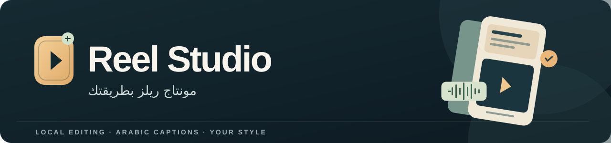
</p>

<h1 align="center">Reel Studio 2.0 🎬</h1>

<p align="center">
  <b>سجّل فكرتك، أو اختار مقاطع من حلقتك… وخلّي المساعد يجهّز ريلز على ذوقك.</b><br>
  مونتاج رأسي 9:16 · كابشن عربي · موشن يوضح الكلام<br>
  Windows 64-bit · مع Claude Code أو Codex
</p>

<p align="center">
  <a href="#start">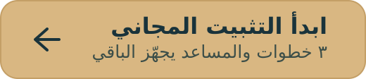</a>
</p>

<p align="center">
  <a href="#whats-new">الجديد في 2.0</a> ·
  <a href="#styles">الـ١١ ستايل</a> ·
  <a href="#podcast-clipping">دفعات البودكاست</a> ·
  <a href="#preferences">ظبّط ذوقك</a> ·
  <a href="#showcase">شوف أمثلة</a> ·
  <a href="#update">حدّث نسختك</a> ·
  <a href="CHANGELOG.md">سجل التحديثات</a>
</p>

**تحط الفيديو، وتقول عايز إيه بالكلام العادي.** المساعد يراجع معاك التفريغ والقص، يبني مشاهد تناسب كلامك، ويفتح محرر تشوف فيه الشغل وهو بيتغيّر. أنت تراجع وتعدّل قبل التصدير؛ مش مطلوب منك تكتب أوامر أو تتعلّم برنامج مونتاج.

كود Reel Studio مجاني بترخيص MIT. استخدام المساعد وتراخيص الأدوات الخارجية منفصلين؛ التفاصيل في [تراخيص الأدوات](NOTICE.md).

<a id="start"></a>

## ابدأ في ٣ خطوات

تحتاج **Windows 64-bit**، وClaude Code أو Codex يقدر يقرأ ملفاتك ويشغّل الأدوات. تحتاج إنترنت للتجهيز والتحديث واستخدام المساعد، ومساحة للأدوات وفيديوهاتك.

1. افتح فولدر فاضي ومستقل للاستوديو في المساعد.
2. انسخ الجملة دي وابعتها له:

   ```text
   نزّل Reel Studio في الفولدر ده من https://github.com/mohamedabdou-ai/reel-studio واتبع AGENTS.md اللي فيه عشان تجهّزه
   ```

3. اختار اسمك وذوقك من الشاشة العربية، واضغط **«احفظ وابدأ»**. المساعد ينزّل الأدوات جوه الفولدر ويتابع التجهيز وفحص النظام معاك.

<p align="center"><a href="docs/images/onboarding-2.0-full.jpg">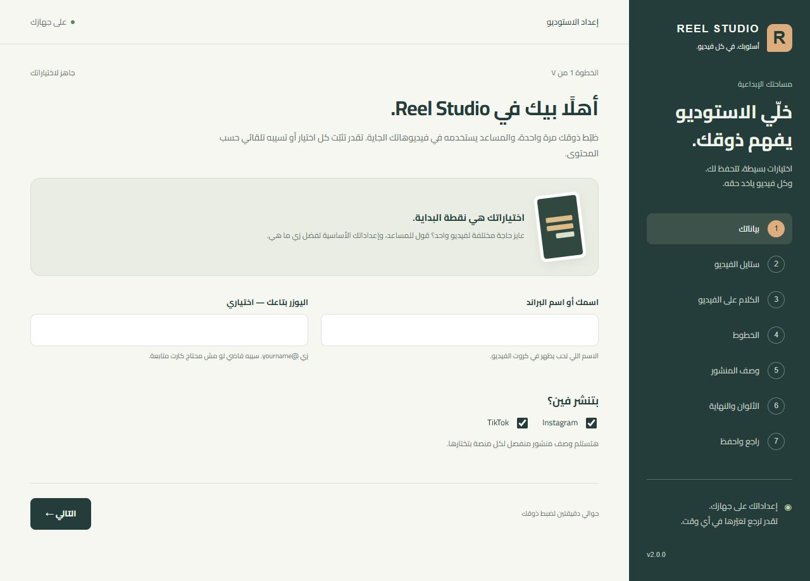</a></p>

<p align="center"><sub>شاشة أول تشغيل كاملة. اضغط على الصورة لعرضها بحجمها الأصلي.</sub></p>

بعد التجهيز، حط الفيديو في فولدر `Raw`، وافتح جلسة جديدة في نفس فولدر الاستوديو، وقول:

```text
عدّل الفيديو Raw/my-video.mp4 لريل إنستجرام وتيك توك.
ورّيني التفريغ واقتراح القص قبل ما تطبّقه، وافتح المحرر وأنا براجع.
```

أول تجهيز بياخد وقت حسب النت والجهاز. لو حاجة وقفت، ابعت للمساعد رسالة الخطأ أو قول **«افحص النظام»**.

<a id="preferences"></a>

## اختار ذوقك مرة… وعدّله وقت ما تحتاج

قول **«افتح إعداداتي»**. تقدر تثبّت كل اختيار، أو تسيبه تلقائي لو الاختيار التلقائي متاح.

<p align="center"><a href="docs/images/settings-2.0-full.jpg">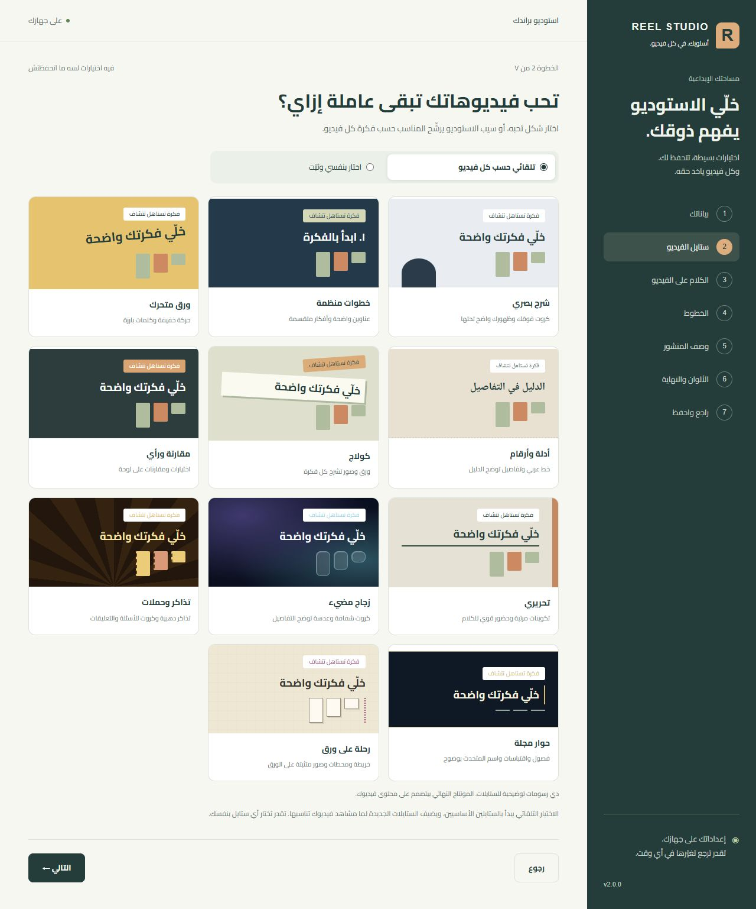</a></p>

<p align="center"><sub>صفحة الاختيار كاملة بالـ١١ ستايل. اضغط لقراءة التفاصيل بالحجم الأصلي.</sub></p>

| الاختيار | اللي تظبطه |
| --- | --- |
| **الستايل** | واحد من ١١ ستايل، أو ترشيح حسب مشاهد الفيديو. |
| **الكلام على الشاشة** | كلمات قصيرة، جُمل، أو كلمة في المرة؛ مع أشكال مختلفة للكابشن. |
| **الخط** | Cairo، Tajawal، IBM Plex Sans Arabic، أو Noto Naskh Arabic. |
| **وصف المنشور** | مختصر، تعليمي، أو حكاية؛ مستقل عن شكل الكابشن على الفيديو. |
| **هويتك** | الاسم والهاندل والمنصات وألوان البراند. |
| **النهاية** | كلمة للكومنت، بطاقة متابعة، الختام المسجّل، أو من غيرهم. |

ولفيديو واحد، قول **«الفيديو ده بس خليه زجاج مضيء»**؛ بروفايلك الأساسي يفضل محفوظ.

<a id="styles"></a>

## شوف الـ١١ ستايل

كل اختيار له شكل مختلف. دي معاينات توضيحية؛ النصوص والصور والتوقيت بيتظبطوا على محتوى فيديوك. الأربعة الجداد لقطات ثابتة من المحرك، والسبعة السابقة معاينات متحركة. اضغط على أي صورة لعرضها.

<table>
  <tr>
    <td align="center" width="33%" valign="top">
      <a href="docs/images/style-liquid-glass.jpg">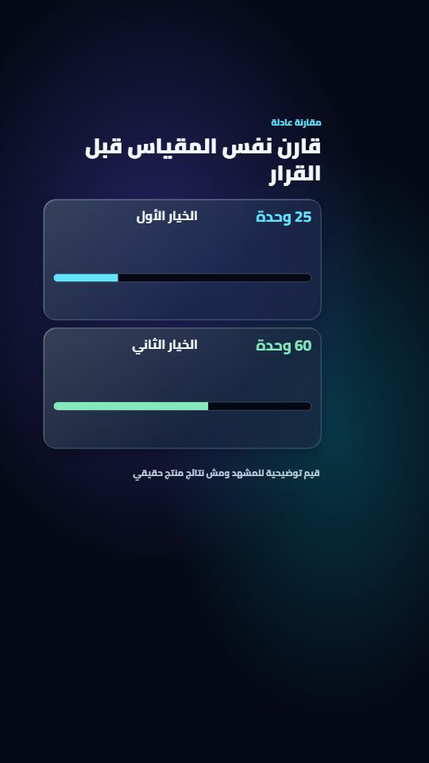</a><br>
      <b>زجاج مضيء</b><br><sub>Liquid Glass</sub><br>
      عدسة وكروت شفافة ومقارنات.<br><sub>جديد · لقطة ثابتة</sub>
    </td>
    <td align="center" width="33%" valign="top">
      <a href="docs/images/style-campaign-tickets.jpg">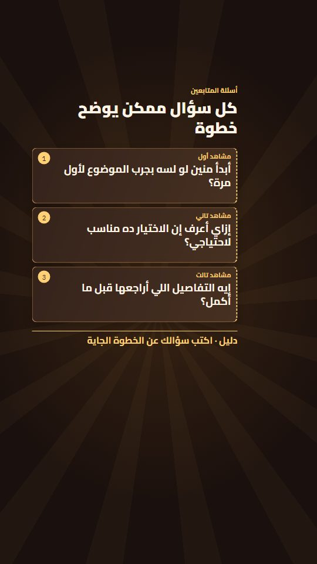</a><br>
      <b>تذاكر وحملات</b><br><sub>Campaign Tickets</sub><br>
      عروض ودعوات وأسئلة على كروت.<br><sub>جديد · لقطة ثابتة</sub>
    </td>
    <td align="center" width="33%" valign="top">
      <a href="docs/images/style-magazine-interview.jpg">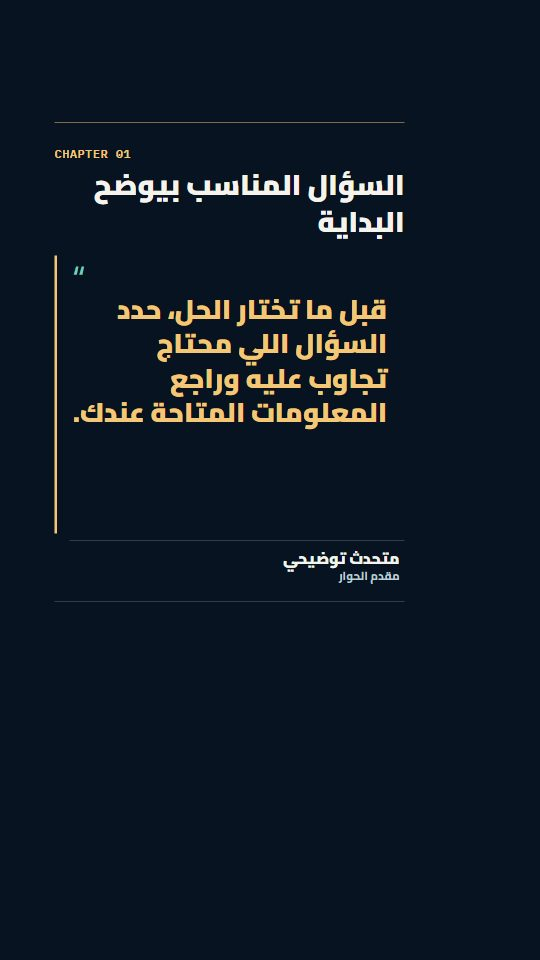</a><br>
      <b>حوار مجلة</b><br><sub>Magazine Interview</sub><br>
      فصول واقتباسات وتعريف المتحدث.<br><sub>جديد · لقطة ثابتة</sub>
    </td>
  </tr>
  <tr>
    <td align="center" width="33%" valign="top">
      <a href="docs/images/style-scrapbook-route.jpg">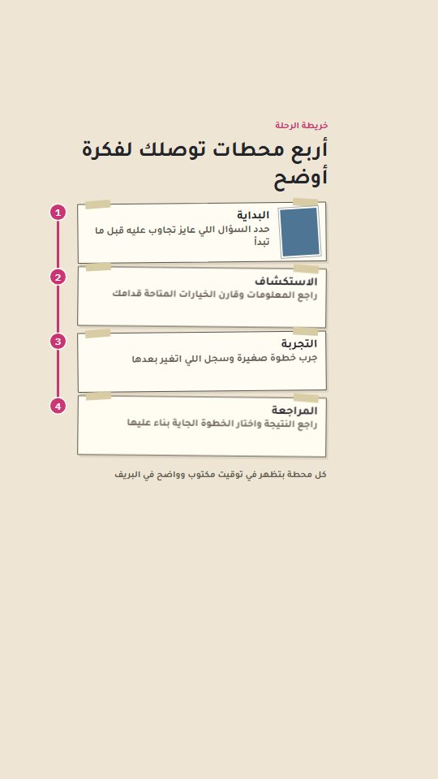</a><br>
      <b>رحلة على ورق</b><br><sub>Scrapbook Route</sub><br>
      خريطة ومحطات وصور.<br><sub>جديد · لقطة ثابتة</sub>
    </td>
    <td align="center" width="33%" valign="top">
      <a href="https://store.pyraai.cloud/wp-content/uploads/2026/09/reel-studio-v1-style-split-canvas.mp4">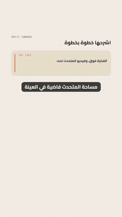</a><br>
      <b>شرح بصري</b><br><sub>Split Canvas</sub><br>
      كروت فوقك، وأنت ظاهر تحتها.<br><sub>معاينة متحركة</sub>
    </td>
    <td align="center" width="33%" valign="top">
      <a href="https://store.pyraai.cloud/wp-content/uploads/2026/09/reel-studio-v1-style-section-deck.mp4">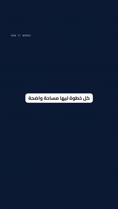</a><br>
      <b>خطوات منظمة</b><br><sub>Section Deck</sub><br>
      عناوين وأفكار متقسمة.<br><sub>معاينة متحركة</sub>
    </td>
  </tr>
  <tr>
    <td align="center" width="33%" valign="top">
      <a href="https://store.pyraai.cloud/wp-content/uploads/2026/09/reel-studio-v1-style-kinetic-paper.mp4">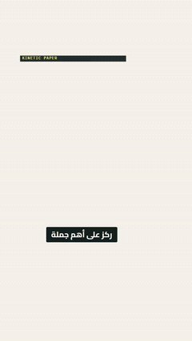</a><br>
      <b>ورق متحرك</b><br><sub>Kinetic Paper</sub><br>
      عنوان قوي وكشف الفكرة بالحركة.<br><sub>معاينة متحركة</sub>
    </td>
    <td align="center" width="33%" valign="top">
      <a href="https://store.pyraai.cloud/wp-content/uploads/2026/09/reel-studio-v1-style-calligraphic-receipts.mp4">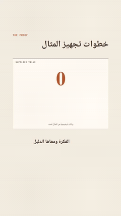</a><br>
      <b>أدلة وأرقام</b><br><sub>Calligraphic Receipts</sub><br>
      كتابة عربية وأدلة وتفاصيل.<br><sub>معاينة متحركة</sub>
    </td>
    <td align="center" width="33%" valign="top">
      <a href="https://store.pyraai.cloud/wp-content/uploads/2026/09/reel-studio-v1-style-paper-collage.mp4">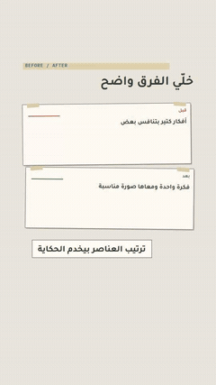</a><br>
      <b>كولاج</b><br><sub>Paper Collage</sub><br>
      ورق وصور تخدم الحكاية.<br><sub>معاينة متحركة</sub>
    </td>
  </tr>
  <tr>
    <td align="center" width="33%" valign="top">
      <a href="https://store.pyraai.cloud/wp-content/uploads/2026/09/reel-studio-v1-style-judgment-board.mp4">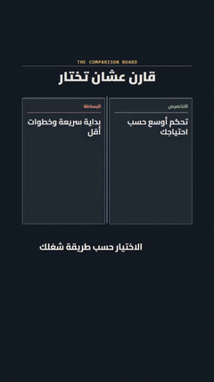</a><br>
      <b>مقارنة ورأي</b><br><sub>Judgment Board</sub><br>
      اختيارات وفروق على لوحة.<br><sub>معاينة متحركة</sub>
    </td>
    <td align="center" width="33%" valign="top">
      <a href="https://store.pyraai.cloud/wp-content/uploads/2026/09/reel-studio-v1-style-stepped-editorial.mp4">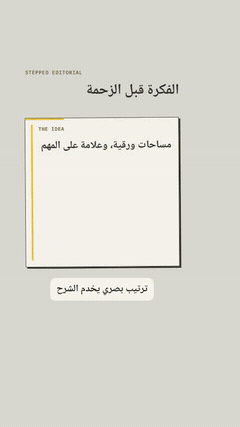</a><br>
      <b>تحريري</b><br><sub>Stepped Editorial</sub><br>
      تكوين مرتب بإحساس مجلة.<br><sub>معاينة متحركة</sub>
    </td>
  </tr>
</table>

**نفس الأسماء اللي هتلاقيها في شاشة الاختيار.** شرح بصري وخطوات منظمة بياخدوا ألوان البراند بتاعك؛ التسعة التانيين بيحتفظوا بألوانهم. الترشيح التلقائي يبدأ بالستايلين الأساسيين، ويضيف واحدًا من الأربعة الجداد لما المشاهد المكتوبة تناسبه.

في **حوار مجلة** فيه اختيار إضافي للعنوان خلف صورة المتحدث: يحتاج قصاصة **PNG شفافة جاهزة منك**، وبيفضل مقفول لحد ما تختاره. الاستوديو ما بيعملش فصل خلفية تلقائي للاختيار ده.

<a id="whats-new"></a>
<a id="motion-explainers"></a>

## إيه الجديد في 2.0؟

| الجديد | فايدته في شغلك |
| --- | --- |
| **٤ ستايلات جديدة** | زجاج مضيء للشرح، تذاكر وحملات للعروض، حوار مجلة للمقابلات، ورحلة على ورق للمحطات والمؤتمرات. |
| **٦ مشاهد تشرح المعنى** | عدسة، مقارنة بمقياس واحد، تذكرة، أسئلة وتعليقات، فصل واقتباس، وخريطة بمحطات وصور. |
| **استكمال الرندر** | لو التصدير وقف، كرّر نفس الطلب؛ الأجزاء السليمة تتستخدم تاني لما الملفات والإعدادات ما تتغيّرش. |
| **تعديل الصوت لوحده** | بدّل التسجيل أو ظبّط المزيكا والمؤثرات في نسخة جديدة تحافظ على الصورة؛ مدة الصوت وتوقيته لازم يتوافقوا مع الفيديو. |
| **تعديل جزء من الصورة** | المساعد يعيد رندر الفريمات المتغيّرة، ويجهّز النسخة الكاملة مع الاحتفاظ بصوت الأصل. |
| **دفعات بودكاست منظمة** | مقترحات تراجعها، مقاطع تختارها، وتجهيز وتصدير بالترتيب مع استكمال الدفعة بعد التوقف. |

الستايلات السابقة وإعداداتك موجودة. [تفاصيل إصدار 2.0.0](https://github.com/mohamedabdou-ai/reel-studio/releases/tag/v2.0.0) · [سجل التغييرات](CHANGELOG.md).

<a id="podcast-clipping"></a>

## حلقة واحدة… مجموعة ريلز

عندك بودكاست أو حوار أو شرح طويل؟ المساعد يقترح مقاطع من التفريغ اللي راجعته، وأنت تختار اللي له بداية ونهاية وفكرة مفهومة.

```text
رشّحلي من الفيديو Raw/example-podcast.mp4 مقاطع قصيرة بأفكار مستقلة.
ورّيني المقترحات الأول، وبعد ما أختار جهّز كل مقطع بكابشن ومونتاج يناسبه.
```

- الاختيار والقص بيتراجعوا معاك قبل تجهيز المقاطع.
- كل مقطع له مشروعه ومحرره وتوقيت كلامه، حتى لو بدأ بعد أول عشر دقائق من التسجيل.
- التصدير بيتم بالترتيب، والدفعة تقدر تكمل بعد التوقف باستخدام النتائج السليمة المطابقة.
- لكل فيديو وصف منفصل للمنصات اللي اخترتها، يتراجع مع محتوى المقطع.
- التسجيل الأصلي يفضل محفوظًا؛ كل مقطع ناتج حده الحالي **١٠ دقائق**.

[دليل دفعات البودكاست للمساعد](instructions/PODCAST.md).

<a id="use-cases"></a>

## قول للمساعد عايز تعمل إيه

| عندك إيه؟ | قول له |
| --- | --- |
| **شرح أداة** | «خلّي كل خطوة تظهر وقت ما بشرحها، وورّيني المعاينة.» |
| **مقارنة** | «اعرض الاختيارين جنب بعض مع كل نقطة بقولها.» |
| **رحلة أو مؤتمر** | «رتّب المحطات والصور في رحلة واضحة، وحافظ على ترتيب كلامي.» |
| **مقابلة** | «قسّم الحوار لفصول، وأبرز الاقتباسات واسم المتحدث.» |
| **تسجيل شاشة** | «ركّز على الخطوات، وورّيني البيانات اللي تحتاج تغبيش.» |
| **صوت اتعدّل** | «بدّل الصوت بالتسجيل الجديد بنفس المدة والتوقيت، وسيب الصورة زي ما هي، واحفظ نسخة جديدة.» |
| **مشهد محتاج تصحيح** | «صلّح العنوان في المشهد ده، واحتفظ بالأصل والصوت.» |
| **رندر وقف** | «كمّل نفس الرندر، واستخدم الأجزاء السليمة لو الملفات والإعدادات ما اتغيّرش فيها حاجة.» |

تعديل جزء من الصورة بيوفّر إعادة رندر مشاهد المونتاج كلها؛ الصورة الكاملة بتعدّي على ترميز خفيف وفحص قبل حفظ النسخة الجديدة. [دليل التعديلات والاستكمال](instructions/PRODUCTION.md).

<a id="delivery-quality"></a>

## تراجع الشغل… وتستلم ملفك

المحرر يفتح من أول مسودة جاهزة، ويتابع تغييرات الكابشن والمشاهد أثناء شغل المساعد. تقدر توقف المتابعة وتعدّل بإيدك. تغيير القص يظهر في الفيديو بعد تجهيز المعاينة الجديدة.

قبل التسليم، المساعد يراجع معاك التسجيل والتفريغ والقص، ويفحص المناطق الآمنة والصوت والتصدير. الرسومات تبعد عن الوش، واللقطات اللي تحتاج مراجعة تتعرض لك. المشكلة اللي تفشل الفحص بتوقف التسليم لحد ما تتصلّح.

بتستلم **MP4 رأسي في `Outputs`**، ومعاه وصف المنشور في **`PUBLISH_PACK.md`** جوه مشروع الفيديو في `Projects`؛ وصف مستقل لإنستجرام وتيك توك حسب اختياراتك.

المناطق الآمنة الحالية مبنية على بروفايلات **Instagram Reels**. فحصها بيعتمد على عينات من المشاهد؛ مراجعة المعاينة والملف النهائي جزء من الشغل. [حدود التقنيات والفحوصات](instructions/TECHNIQUES.md).

<a id="showcase"></a>
<a id="examples"></a>
<a id="camera-explainers"></a>
<a id="product-explainers"></a>

## شوف أمثلة من الشغل

**يمين: التصوير الأصلي. شمال: بعد المونتاج.** اضغط على المثال عشان تشوف المقطع.

<table>
  <tr>
    <td align="center" width="50%"><a href="https://store.pyraai.cloud/wp-content/uploads/2026/09/reel-studio-v1-before-after-card.mp4">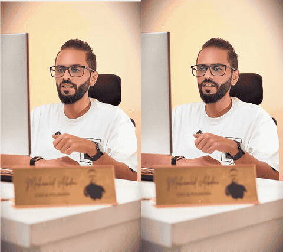</a><br><b>أنت داخل بطاقة</b></td>
    <td align="center" width="50%"><a href="https://store.pyraai.cloud/wp-content/uploads/2026/09/reel-studio-v1-before-after-split.mp4">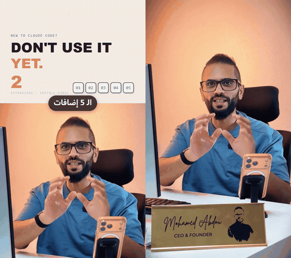</a><br><b>الفكرة مع المتحدث</b></td>
  </tr>
</table>

الأمثلة دي من أعمال **محمد عبده** بالنظام الكامل اللي اتبنى منه Reel Studio. مشاهدها اتصمّمت لمحتواها؛ الحزمة فيها الأدوات القابلة للاستخدام الموضّحة فوق، والنتيجة بتعتمد على فيديوك واختياراتك ومراجعتك.

<details>
<summary><b>أمثلة أكتر: موشن، مؤتمرات، بودكاست، وشرح عملي</b></summary>

<table>
  <tr>
    <td align="center" width="50%">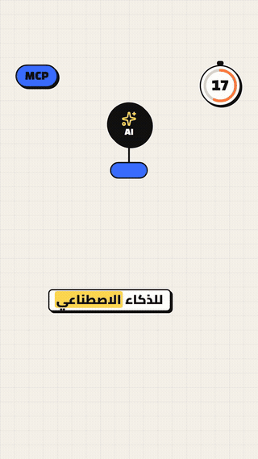<br><b>شرح بالموشن</b></td>
    <td align="center" width="50%">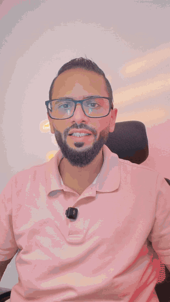<br><b>مؤتمر ورحلة</b></td>
  </tr>
  <tr>
    <td align="center" width="50%">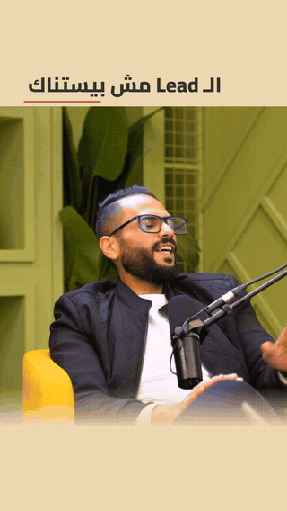<br><b>مقاطع من بودكاست</b></td>
    <td align="center" width="50%">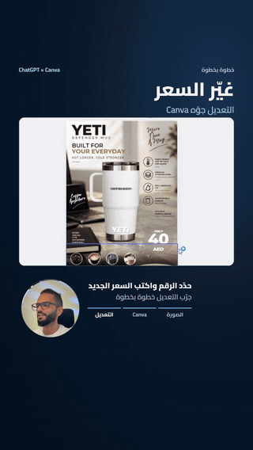<br><b>شرح عملي</b></td>
  </tr>
  <tr>
    <td align="center" width="50%">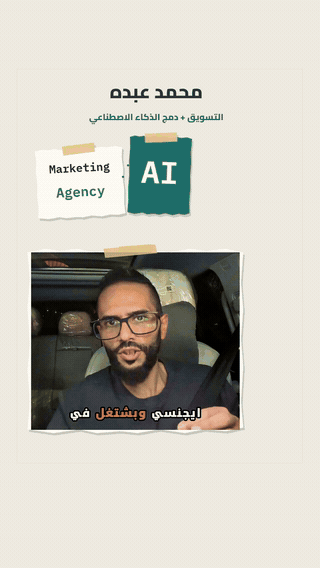<br><b>خطوات ورحلة عميل</b></td>
    <td align="center" width="50%">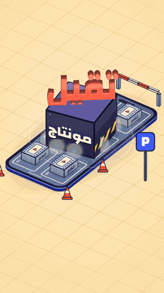<br><b>إعلان مخصّص بالنظام الكامل</b></td>
  </tr>
</table>

<details>
<summary><b>كولاج، كتابة عربية، وأمثلة تانية</b></summary>

<table>
  <tr>
    <td align="center" width="33%"><a href="https://store.pyraai.cloud/wp-content/uploads/2026/09/reel-studio-v1-loop-collage.mp4">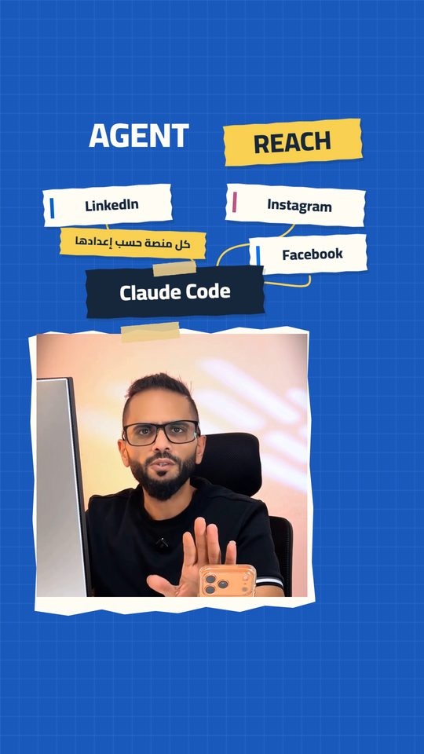</a><br><b>كولاج</b></td>
    <td align="center" width="33%"><a href="https://store.pyraai.cloud/wp-content/uploads/2026/09/reel-studio-v1-loop-calligraphy.mp4">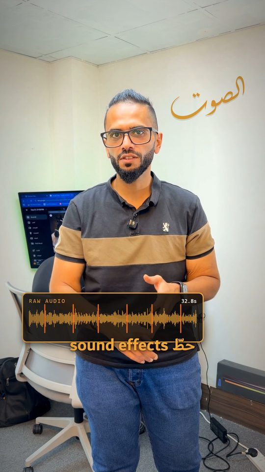</a><br><b>كتابة عربية</b></td>
    <td align="center" width="33%"><a href="https://store.pyraai.cloud/wp-content/uploads/2026/09/reel-studio-v1-loop-data-story.mp4">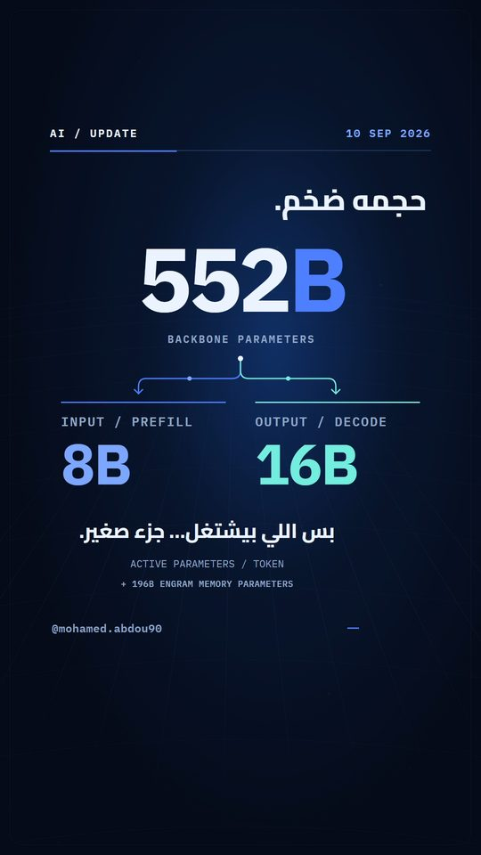</a><br><b>شرح أرقام</b></td>
  </tr>
</table>

<p align="center">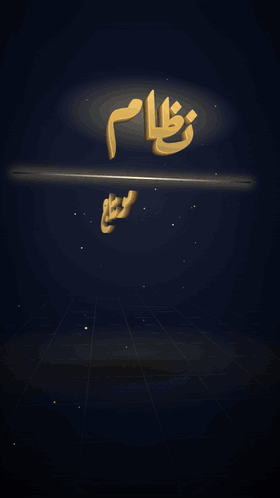</p>

</details>

معاينات GIF المعروضة في الصفحة صامتة. إعلانات 3D والتعليق الصوتي المولّد فيها شغل مخصّص من النظام الكامل؛ الحزمة بتشتغل على تسجيلك، وما بتضيفش توليد صوت أو قالب الإعلانات دي.

[مصادر الأمثلة وحقوقها](docs/media/README.md).

</details>

<a id="update"></a>

## عندك نسخة؟ حدّثها بنفس الطريقة

قول للمساعد **«حدّث الاستوديو»**. وبعد ما يخلص، افتح جلسة جديدة في نفس الفولدر عشان يقرأ التعليمات الجديدة.

ملفات التحديث منفصلة عن بروفايلك وتسجيلاتك ومشاريعك وتصديراتك. لو ملفات النظام نفسها متعدّلة، التحديث يقف ويوضح لك بدل ما يستبدلها.

لو ظهر خطأ، ابعته للمساعد عشان يحدد سببه. احتفظ بالنسخة القديمة لو احتجت تجهيز فولدر جديد؛ حذف مشاريعك مش خطوة مطلوبة للتحديث.

[آخر إصدار](https://github.com/mohamedabdou-ai/reel-studio/releases/latest) · [الجديد في كل نسخة](CHANGELOG.md).

## أسئلة سريعة

<details>
<summary><b>ينفع على الموبايل أو Mac؟</b></summary>

التجهيز الحالي مخصص لـWindows 64-bit. الموبايل وmacOS مش مدعومين حاليًا.

</details>

<details>
<summary><b>الفيديوهات بتترفع؟ وبينشر بدلّي؟</b></summary>

التفريغ والرندر والفحوصات بتتم على جهازك. Reel Studio نفسه ما بيرفعش فيديوهاتك ولا بينشرها؛ استخدام المساعد بيخضع لإعدادات وخصوصية الخدمة اللي تختارها. بتراجع الملف ووصف المنشور وتنشر بنفسك.

</details>

<details>
<summary><b>أحتاج برنامج مونتاج أو أكتب أوامر؟</b></summary>

المساعد بيجهّز الأدوات ويشغّلها. أنت تختار وتراجع وتتكلّم معاه بالكلام العادي، وتقدر تعدّل من محرر المراجعة.

</details>

<details>
<summary><b>التجهيز وقف أو عايز تبلغ عن مشكلة؟</b></summary>

ابعت للمساعد رسالة الخطأ. ولو هتفتح [Issue](https://github.com/mohamedabdou-ai/reel-studio/issues/new)، اكتب الإصدار والخطوة اللي وقفت ورسالة الخطأ، واحذف أي بيانات شخصية من الصور والسجلات.

</details>

## أدلة للمساعد والمساهمين

| الدليل | هتلاقي فيه إيه؟ |
| --- | --- |
| [AGENTS.md](AGENTS.md) | نقطة البداية والتثبيت وطريقة التعامل مع صاحب الفيديو. |
| [التجهيز والتحديث](instructions/SETUP.md) | التثبيت وفحص النظام والتحديث. |
| [رحلة المونتاج](instructions/EDITING.md) | من مراجعة التسجيل لحد التسليم ووصف المنشور. |
| [الستايلات](instructions/STYLES.md) | الاختيارات والمشاهد وحدود كل ستايل. |
| [دفعات البودكاست](instructions/PODCAST.md) | اختيار المقاطع وتجهيزها وتصديرها بالترتيب. |
| [الاستكمال والتعديلات](instructions/PRODUCTION.md) | رندر على أجزاء، تعديل الصوت، وتصحيح جزء من الصورة. |
| [محرر المراجعة](instructions/REVIEW-EDITOR.md) | المعاينة والتعديل اليدوي والحفظ. |
| [التقنيات والفحوصات](instructions/TECHNIQUES.md) | القدرات اللي في الحزمة وحدودها. |
| [دليل المساهمة](CONTRIBUTING.md) | تنظيم الملفات وفحوصات التعديل والنشر. |
| [سجل التحديثات](CHANGELOG.md) | الجديد في كل إصدار. |

---

**صنعه محمد عبده.** لو فادك، حط ⭐ للريبو، وتابع [@mohamed.abdou90 على إنستجرام](https://www.instagram.com/mohamed.abdou90/) للأمثلة والجديد.

[رخصة MIT](LICENSE) · [تراخيص الأدوات الخارجية](NOTICE.md)

</div>
